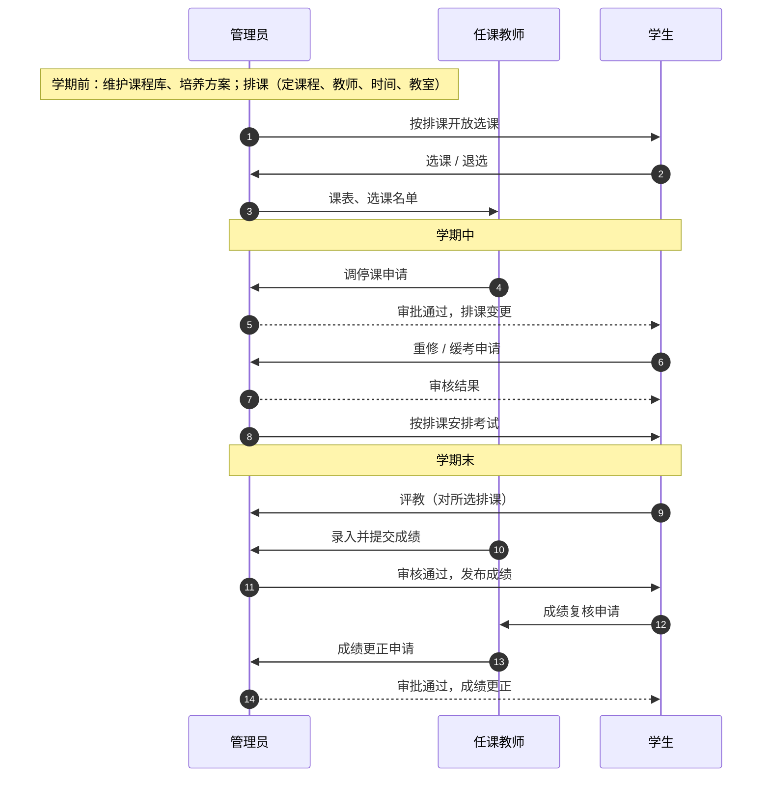

# 精简版中时序图的 Mermaid 源码

E-R 图由 `gen_er.mjs` 生成（`node gen_er.mjs --png`），不在这里。

```mermaid
sequenceDiagram
    autonumber
    participant A as 管理员
    participant T as 任课教师
    participant S as 学生
    Note over A: 学期前：维护课程库、培养方案；排课（定课程、教师、时间、教室）
    A->>S: 按排课开放选课
    S->>A: 选课 / 退选
    A->>T: 课表、选课名单
    Note over A,S: 学期中
    T->>A: 调停课申请
    A-->>S: 审批通过，排课变更
    S->>A: 重修 / 缓考申请
    A-->>S: 审核结果
    A->>S: 按排课安排考试
    Note over A,S: 学期末
    S->>A: 评教（对所选排课）
    T->>A: 录入并提交成绩
    A->>S: 审核通过，发布成绩
    S->>T: 成绩复核申请
    T->>A: 成绩更正申请
    A-->>S: 审批通过，成绩更正
```
